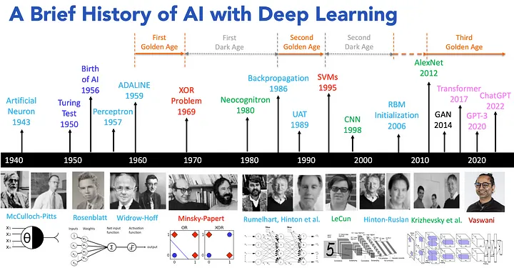
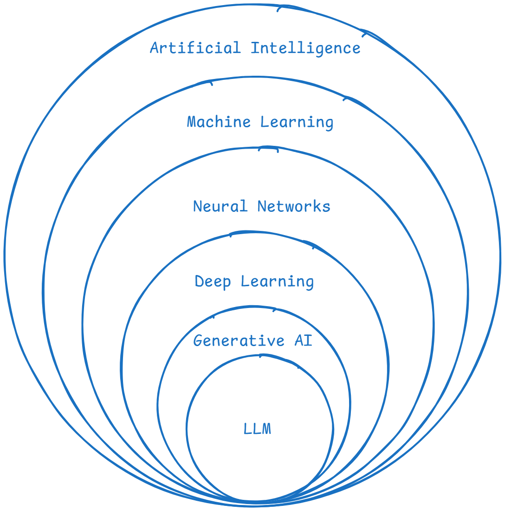
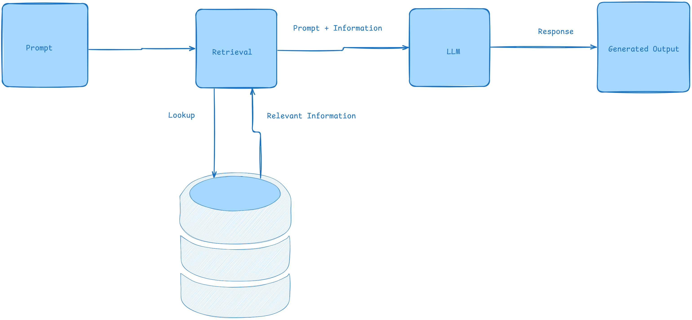

<!-- _class: header -->

<!-- _backgroundColor: '#0E1536' -->
<!-- _color: white -->

# Artificial Intelligence

---

# Outline

- AI in a nutshell
  - What is AI, a bit of history, the big definitions
  - Supervised, Unsupervised, Reinforcement, Generative
- Deep dive: how LLMs actually work
  - Tokens, embeddings, transformers, attention
  - Parameters, context window, KV cache, temperature, quantization
  - How they are trained, and where they fail
- Putting LLMs to work
  - System prompt, context, tools, RAG, MCP, agents
- Live demo + Q&A

---

---

## What is AI?

Systems or machines that can simulate human intelligence.

- **Learning** from data (machine learning)
- **Reasoning** to solve problems
- **Understanding** language (natural language processing)
- **Perceiving** the world (computer vision)
- **Acting** autonomously (virtual agents)

---

## Definitions

- **Artificial Intelligence (AI):** A branch of computer science focused on creating machines that simulate human intelligence.
- **Machine Learning (ML):** Enables systems to learn from data and improve over time without explicit programming.
- **Neural Networks (NNs):** Computational models inspired by the human brain, used for pattern recognition and classification.
- **Deep Learning (DL):** A subset of ML that uses multi-layered neural networks to model complex patterns in data.
- **Generative AI (GenAI):** AI systems capable of creating new content, such as text, images, or audio.
- **Large Language Models (LLMs):** Advanced GenAI models specialized in understanding and generating human language.
---

---

## The Types of Machine Learning

| Supervised | Unsupervised | Reinforcement |
| --- | --- | --- |
| Learns from **labeled** data | Finds patterns in **unlabeled** data | Learns by **trial, reward, penalty** |
| Predicts outcomes for new inputs | Groups and structures data on its own | An agent acts inside an environment |
| Spam filters, price prediction | Customer segments, anomaly detection | Game AI, robotics, self-driving |

**Generative AI** is the fourth flavor — instead of classifying, it *creates*. That is where LLMs live, and where we spend the rest of the talk.

<!--
~1.5 min. Don't read the table cell by cell. One line each:
- Supervised = learn with an answer key (labeled cats vs dogs).
- Unsupervised = no answer key, find the groups yourself.
- Reinforcement = trial and error with rewards (training a dog / AlphaGo).
Then pivot hard: "Three old ideas. The fourth — generative — is why we're here."
This single slide replaces last year's 6 slides + video to protect time.
-->

---
<!-- _class: header -->

<!-- _backgroundColor: '#0E1536' -->
<!-- _color: white -->

# How LLMs Work

### The deep dive

---

# Generative AI

- Generative AI creates new content — text, images, audio — by learning patterns from existing data.
- A language model does one thing, over and over: **predict the next token** given everything before it.
- Do that billions of times on most of the internet, and "predict the next word" turns into writing, translating, and coding.

<!--
~1.5 min. THE mental model: an LLM is autocomplete on steroids.
Live: "The capital of France is ___" → they shout Paris. "You just did what it does."
Set up the honest caveat early: it predicts plausible text, it doesn't 'know' truth.
Everything in this section explains how that one trick becomes so powerful.
-->

---

## Tokens & Tokenization

LLMs don't read words or letters — they read **tokens**.

- A token is a chunk of text, roughly **¾ of a word** (~4 characters).
- "tokenization" might split into `token` + `ization`; rare words and code split into more pieces.
- Context limits and **pricing are measured in tokens**, not words.

<!--
~2 min. Show it concretely: write "tokenization" and split it on the board.
Why care: this is why models miscount letters ("how many r's in strawberry") and
why your API bill is per-token. Everything downstream is token in → token out.
-->

---

## Embeddings

Every token is turned into an **embedding** — a long list of numbers (a vector) that captures its meaning.

- Similar meanings land **close together** in this space.
- Classic example: `king − man + woman ≈ queen`.
- This is what powers **semantic search** and RAG (later).

<!--
~2 min. Analogy: a map where related ideas are neighbors — "Paris" sits near
"France" and "city", far from "banana". The model reasons over these vectors,
not raw text. Bridge: "How does it decide which words matter to each other?" → attention.
-->

---

## The Transformer

The architecture behind every modern LLM (GPT, Claude, Llama, Gemini).

- Introduced in 2017 — replaced older sequential models (RNNs).
- Processes **all tokens in parallel** instead of one at a time → trains far faster on GPUs.
- Built from stacked layers; the key ingredient inside each layer is **attention**.

<!--
~2.5 min. Keep it conceptual, no math. The headline: ONE architecture powers the
whole field — learn it once, it applies everywhere. The 2017 paper unlocked the
scale that made today's models possible (parallelism = you can throw GPUs at it).
-->

---

## Attention — "Attention Is All You Need"

The 2017 paper (Vaswani et al., Google) that started it all.

- **Self-attention** lets every token look at every other token and weigh **how relevant** each one is.
- That's how the model tracks context and long-range meaning.
- *"The animal didn't cross the street because **it** was tired"* — attention links **it → animal**.

<!--
~2.5 min. This is the heart of the deep dive — spend a beat here.
The "it" example sells it: the model learns what "it" refers to by attending to
the right earlier word. Multiply that across every token and layer = understanding
of context. Name-drop the paper title; interns will Google it (it's in Resources).
-->

---

## Parameter Size

**Parameters** are the learned weights — the knobs tuned during training.

- Sizes you'll hear: **8B, 70B, 405B+** (billions of parameters).
- More parameters ≈ more capacity and knowledge, but more compute, memory, and cost.
- The weights must sit in memory: a 70B model in 16-bit ≈ **140 GB** of GPU memory just to load.

<!--
~1.5 min. Bigger isn't free. This opens the MEMORY & COST thread:
weights live in expensive GPU VRAM. Hold that thought — KV cache adds to it, and
quantization (two slides on) is how we fight back. Foreshadow it explicitly.
-->

---

## Context Window

The maximum number of tokens the model can consider at once — its **working memory**.

- Includes both your **input** and the model's **output**.
- Ranges from a few thousand tokens to **1M+** in recent models.
- Anything outside the window is simply **forgotten** — the model is stateless between calls.

<!--
~1.5 min. Analogy: the model can only "see" what's on the desk right now. Bigger
window = read a whole codebase or book at once. But it isn't free — cost and memory
grow with length, which is exactly the next slide.
-->

---

## KV Cache — why memory is expensive

To generate each new token, the model would normally re-run attention over the **entire** sequence. The **KV cache** stores the past keys/values so it only computes the new token.

- Huge speedup — but the cache lives in **GPU VRAM**.
- It grows with **context length × layers × concurrent users**.
- So **memory, not raw compute, is the real cost driver**: long contexts + many users = lots of pricey high-bandwidth GPU RAM.

<!--
~2 min. This answers "why is serving LLMs so expensive / why so much RAM?"
Two things compete for VRAM: the weights (prev slide) AND the KV cache (this slide).
Double a 1000-user service's context length → roughly double the KV-cache RAM.
That's why GPUs with more memory cost a fortune. Set up quantization as the fix.
-->

---

## Temperature — the "heat" of an LLM

A knob that controls **randomness** when picking the next token.

- **Low (≈0):** deterministic — always grabs the most likely token. Good for facts, code.
- **High (≈1+):** more random and creative — good for brainstorming, writing.
- Related knobs: **top-p / top-k** (limit the pool of candidate tokens).

<!--
~1.5 min. Demo idea: same prompt at temp 0 vs temp 1 → identical vs wildly varied.
Mental model: temperature = how adventurous the model is when it gambles on the
next word. Not "smarter", just more or less predictable.
-->

---

## Quantization

Storing the weights at **lower precision** to save memory.

- 16-bit → **8-bit → 4-bit**: roughly halve, then quarter the memory.
- Small quality loss, big savings — run a model that needed a server **on a laptop or one GPU**.
- Shrinks both the **weights** and the **KV cache** → the payoff to the cost problem.

<!--
~1.5 min. Close the memory & cost thread: parameters + KV cache fill VRAM;
quantization is how you fit a big model into less of it. Analogy: a high-res photo
saved as a slightly compressed JPEG — almost the same, a fraction of the size.
This is why "run Llama on your MacBook" is even possible.
-->

---

## How LLMs Are Trained

Three stages turn raw text into a helpful assistant.

1. **Pretraining** — predict the next token across enormous text. Slow, expensive (months, millions of dollars). Produces raw knowledge.
2. **Fine-tuning (SFT)** — train on curated instruction/answer examples so it follows instructions.
3. **RLHF** — humans rank answers; the model is tuned to prefer the helpful, safe ones.

<!--
~2 min. Map it: pretraining = read the library (knows a lot, not helpful yet).
Fine-tuning = teach it to answer when asked. RLHF = polish manners & safety using
human preferences. RLHF is partly why ChatGPT felt so different from raw GPT-3.
-->

---

## Limitations — keep these in mind

- **Hallucinations** — confidently states things that are false.
- **Knowledge cutoff** — doesn't know events after its training data.
- **No real understanding** — it predicts patterns; it doesn't verify truth.
- **Weak at exact math / counting**, and it inherits **bias** from its data.

<!--
~1.5 min. The #1 thing interns must internalize: LLMs are confident, not correct.
Every tool in the next section (context, tools, RAG, MCP) exists to patch these gaps —
that's the transition.
-->

---
<!-- _class: header -->

<!-- _backgroundColor: '#0E1536' -->
<!-- _color: white -->

# Putting LLMs to Work

---

## Prompting & the System Prompt

- **Prompt** = the instructions and question you send the model.
- **System prompt** = hidden top-level instructions that set the model's role, rules, and persona for the whole conversation.
- Good prompting = be clear, give examples, state constraints and the output format.

<!--
~1.5 min. The system prompt is the "job description"; the user prompt is the task.
Tie back to limitations: you steer behaviour with words, not code. Quick example of
a vague vs specific prompt and how the output changes.
-->

---

## Context

LLMs are **stateless** — they only know what's in the current context window.

- Every call you assemble: **system prompt + conversation history + retrieved docs + tool outputs**.
- Deciding what to include is **context engineering**.
- Garbage in → garbage out; the right context is often more important than the model.

<!--
~1.5 min. Callback to context window + stateless from Part 2. The skill isn't
"ask better questions", it's "feed the model the right information". This is the
job behind RAG and agents — both are really context-assembly machines.
-->

---

## Tools / Function Calling

An LLM can only produce text — **tools** give it hands.

- You describe functions it can call (search, calculator, database, any API).
- The model outputs a **structured call** → your code runs it → the result goes back into context.
- This loop is the foundation of **agents**.

<!--
~1.5 min. Example: ask "what's 9384 × 271?" — a tool-enabled model calls a
calculator instead of guessing. Same for "search the web" or "query our DB".
The model decides WHEN to use a tool; your code does the actual work.
-->

---

## Retrieval Augmental Generation (RAG)

An AI technique that combines retrieving relevant information from external sources with generating natural language responses to provide more accurate and informed answers.

<!--
~1.5 min. The fix for hallucinations + knowledge cutoff. Open-book exam: retrieve
the right docs first, then answer from them. This is how "chat with your PDF" and
internal-docs bots work — and it leans on embeddings from Part 2.
-->

---

---

# **Model Context Protocol (MCP)**

An **open standard** (Anthropic, 2024) for connecting AI apps to **external tools and data** — without writing custom glue for every integration. Think of it as the **USB-C port for AI**.

- An **MCP server** wraps a tool or data source (files, GitHub, a database, Slack…).
- An **MCP client** is the AI app (an IDE, Claude Code, your agent) that connects to it.
- Build a connector **once** → every MCP-compatible app can use it.

<!--
~1.5 min. NOTE: this corrects last year's slide, which framed MCP as a memory/
orchestration layer — that was inaccurate. MCP is a PROTOCOL (a shared plug shape).
Before MCP: every app × every tool = custom integration (the M×N problem).
After MCP: write it once, any client speaks it. Leads straight into the demo.
-->

---

## Agents

Agents are AI systems that can autonomously perceive their environment, reason, and take actions to achieve specific goals, often using chain-of-thought reasoning.

<!--
~1 min. Combine everything so far: an agent = LLM + context + tools, run in a loop.
Plain LLM tells you how to do something; an agent goes and does it.
-->

---

## Agents in Practice

An agent wraps an LLM in a loop: **think → use a tool → observe the result → repeat** until the goal is reached. The system around the model—the loop, tools, memory, and permissions—is called the **harness**.

Popular agentic coding tools:

- **Claude Code** — Anthropic's terminal-based coding agent
- **Codex** — OpenAI's coding agent
- **opencode** — open-source terminal coding agent
- **OpenClaw** — open-source, model-agnostic agent harness

<!--
~1 min. Make it real: "this presentation was edited by one of these." The model is
the engine; the harness is the whole car. Same model + better harness = very
different results. Segue: "let's watch one work."
-->

---

## Demo: Booking a Flight with MCP

We connect **Claude Code** to an **Octopus price-search MCP server**.

- The MCP server exposes flight **price search** and **booking** as tools
- Claude Code connects to it as an MCP **client**
- We ask in plain language → the agent searches prices and books a flight

<!--
~6 min. PRE-FLIGHT (before the talk): start the MCP server, confirm Claude Code
sees its tools, have a fallback screen recording ready.
RUN: give a natural-language request → narrate as the agent calls the price-search
tool, reasons over results, then the booking tool. Take one request from the room
if time allows. If it breaks, narrate the debugging — that's a real AI lesson too.
-->

---

# Q&A

<!--
~4 min buffer. Seed questions if quiet:
- "Will AI take my job?" → it changes the job; learn to direct it.
- "RAG vs fine-tuning?" → RAG adds knowledge, fine-tuning changes behaviour/style.
- "Is it actually thinking?" → no — it predicts patterns. Powerful, not conscious.
Close: "Best way to learn this is to use it on something you care about this week."
-->

---

# **Resources**

- A brief history of AI — https://medium.com/@lmpo/a-brief-history-of-ai-with-deep-learning-26f7948bc87b
- AI overview — https://medium.com/womenintechnology/ai-c3412c5aa0ac
- How LLMs work (video) — https://www.youtube.com/watch?v=LPZh9BOjkQs
- Attention Is All You Need (2017) — https://arxiv.org/abs/1706.03762
- Model Context Protocol — https://modelcontextprotocol.io
