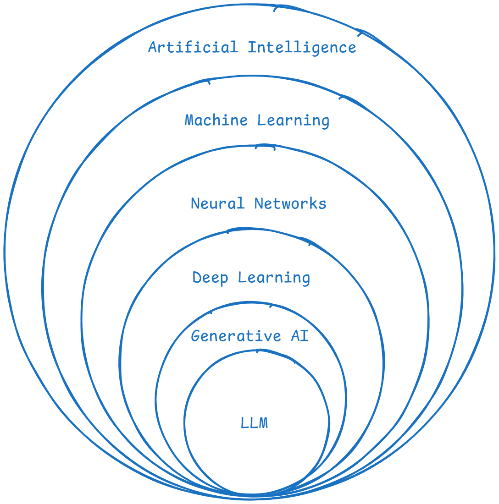

<!-- _class: header -->

<h1 style="text-align: center;">Artificial Intelligence</h1>

---

# **Outline**

- History of AI
  - What is AI?
  - Definitions
- AI Overview
  - Supervised, Unsupervised, Reinforcement, Generative AI
- Generative AI
  - LLMs, Agents, RAG, MCP
- RAG Demo
- Q&A

---

# History of AI

  

---

## What is AI?

Systems or machines that can simulate human intelligence.

- **Learning** from data (machine learning)
- **Reasoning** to solve problems
- **Understanding** language (natural language processing)
- **Perceiving** the world (computer vision)
- **Acting** autonomously (virtual agents)

---

## Definitions

  

---

- **Artificial Intelligence (AI):** A branch of computer science focused on creating machines that simulate human intelligence.
- **Machine Learning (ML):** Enables systems to learn from data and improve over time without explicit programming.
- **Neural Networks (NNs):** Computational models inspired by the human brain, used for pattern recognition and classification.
- **Deep Learning (DL):** A subset of ML that uses multi-layered neural networks to model complex patterns in data.
- **Generative AI (GenAI):** AI systems capable of creating new content, such as text, images, or audio.
- **Large Language Models (LLMs):** Advanced GenAI models specialized in understanding and generating human language.

---

# Overlook of AI

- Supervised Learning
- Unsupervised Learning
- Reinforcement Learning
- Generative AI

## Supervised Learning

## Unsupervised Learning

## Reinforcement Learning

## Generative AI

---

# **Resources**

- https://medium.com/@lmpo/a-brief-history-of-ai-with-deep-learning-26f7948bc87b

- https://medium.com/womenintechnology/ai-c3412c5aa0ac
