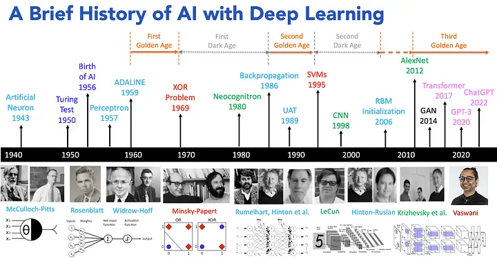
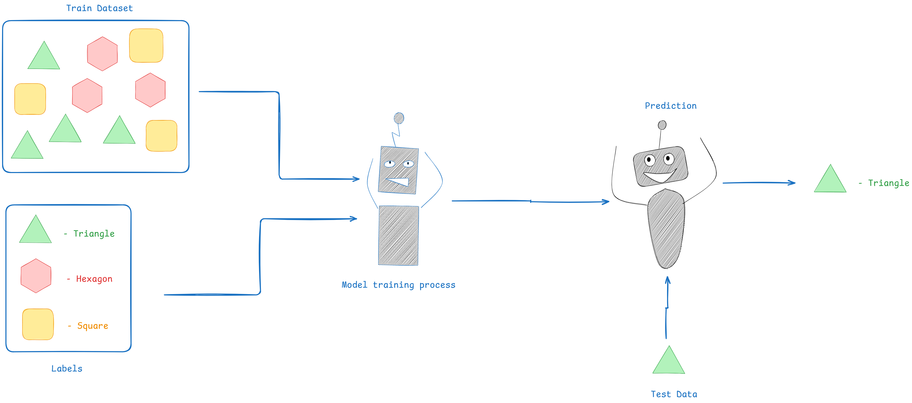

<!-- _class: header -->

<h1 style="text-align: center;">Artificial Intelligence</h1>

---

---

# **Outline**

- History of AI
  - What is AI?
  - Definitions
- AI Overview
  - Supervised, Unsupervised, Reinforcement, Generative AI
- Generative AI
  - LLMs, Agents, RAG, MCP
- RAG Demo
- Q&A

---

---

## What is AI?

Systems or machines that can simulate human intelligence.

- **Learning** from data (machine learning)
- **Reasoning** to solve problems
- **Understanding** language (natural language processing)
- **Perceiving** the world (computer vision)
- **Acting** autonomously (virtual agents)

---

## Definitions

{ style="max-width: 70%; height: auto;" }

---

- **Artificial Intelligence (AI):** A branch of computer science focused on creating machines that simulate human intelligence.
- **Machine Learning (ML):** Enables systems to learn from data and improve over time without explicit programming.
- **Neural Networks (NNs):** Computational models inspired by the human brain, used for pattern recognition and classification.
- **Deep Learning (DL):** A subset of ML that uses multi-layered neural networks to model complex patterns in data.
- **Generative AI (GenAI):** AI systems capable of creating new content, such as text, images, or audio.
- **Large Language Models (LLMs):** Advanced GenAI models specialized in understanding and generating human language.

---

# Overlook of AI

- Supervised Learning
- Unsupervised Learning
- Reinforcement Learning
- Generative AI

---

## Supervised Learning

Supervised learning is a type of machine learning where models are trained on labeled data to predict outcomes for new, unseen inputs.

---

---

## Unsupervised Learning

Unsupervised learning is a machine learning approach where models find patterns or groupings in data without labeled outcomes.

---

---

## Reinforcement Learning

Reinforcement learning is a type of machine learning where an agent learns to make decisions by interacting with an environment and receiving rewards or penalties based on its actions.

---

  <iframe width="560" height="315" src="https://www.youtube.com/embed/hgjsLmFSkxo" title="YouTube video player" frameborder="0" allow="accelerometer; autoplay; clipboard-write; encrypted-media; gyroscope; picture-in-picture; web-share" allowfullscreen></iframe>

---

# Generative AI

- Generative AI refers to systems that can create new content—such as text, images, or audio—by learning patterns from existing data.
- It predicts which token will be next based on previous tokens.

---

## Large Language Models (LLMs)

Large Language Models (LLMs) are advanced AI models trained on vast amounts of text data to understand and generate human-like language.

---

## Agents

Agents are AI systems that can autonomously perceive their environment, reason, and take actions to achieve specific goals, often using chain-of-thought reasoning.

## 

---

## Retrieval Augmental Generation (RAG)

---

## Model Context Protocol (MCP)

---

# Q&A

---

# **Resources**

- https://medium.com/@lmpo/a-brief-history-of-ai-with-deep-learning-26f7948bc87b

- https://medium.com/womenintechnology/ai-c3412c5aa0ac

- https://www.youtube.com/watch?v=LPZh9BOjkQs
